# VULNERABLE-MACHINE-BLUE-MOON

# 🔐 Vulnerability Analysis Report

## System Hacking Lab – BlueMoon (VulnHub)

---

## 📌 1. Introduction

This lab focuses on performing system hacking techniques in a controlled environment using the **BlueMoon vulnerable machine** from VulnHub and an attacker machine running Kali Linux.

The objective is to simulate real-world attack stages including reconnaissance, scanning, gaining access, and identifying system weaknesses.

---

## 🎯 2. Objectives

* Identify vulnerabilities in a target system
* Perform enumeration and brute-force techniques
* Simulate gaining access to the system
* Apply security defense strategies

---

## 🧪 3. Lab Environment Setup

### Attacker Machine:

* Kali Linux VM

### Target Machine:

* BlueMoon (VulnHub VM)

### Virtualization:

* Oracle VM VirtualBox

### Network Configuration:

* Host-Only Adapter (internal attack network)
* NAT Adapter (internet access for Kali)

---

## 🔍 4. Methodology

The penetration testing process follows:

1. Reconnaissance
2. Scanning
3. Gaining Access
4. Privilege Escalation
5. Maintain Access
6. Clear Tracks

---

# 🛰️ 5. Reconnaissance

### Tool:

* netdiscover

### Command:

```bash
sudo netdiscover
```

### Result:

* 192.168.56.107 → Attacker (Kali)
* 192.168.56.100 → Unknown host
* 192.168.56.106 → Target (BlueMoon)

### 📸 Screenshot:

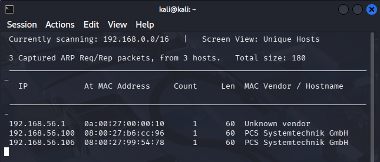

---

### IP Verification:

```bash
ip a
```

### 📸 Screenshot:

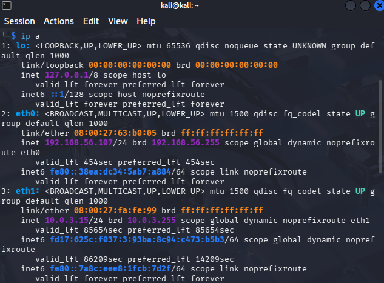

---

### Analysis:

Using netdiscover, multiple hosts were identified on the network. The attacker machine was identified as 192.168.56.107, while potential targets were 192.168.56.100 and 192.168.56.106.

---

# 🔎 6. Scanning

### Tool:

* Nmap

### Commands:

```bash
nmap -sC -sV 192.168.56.100
nmap -sC -sV 192.168.56.106
```

---

### Results:

| Port | Service | Version       |
| ---- | ------- | ------------- |
| 21   | FTP     | vsftpd 3.0.3  |
| 22   | SSH     | OpenSSH 7.9   |
| 80   | HTTP    | Apache 2.4.38 |

### 📸 Screenshot:

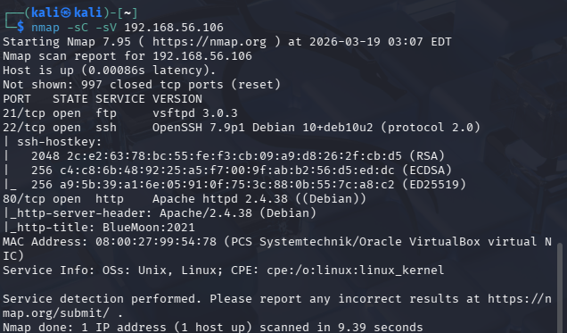

---

### Analysis:

Nmap scanning revealed multiple open ports including FTP (21), SSH (22), and HTTP (80), indicating several possible attack vectors.

---

# 🌐 7. Web Enumeration

### Access Website:

```
http://192.168.56.106
```

### Observation:

* Simple page
* Message: *“Are You Ready To Play With Me…!”*

### 📸 Screenshot:

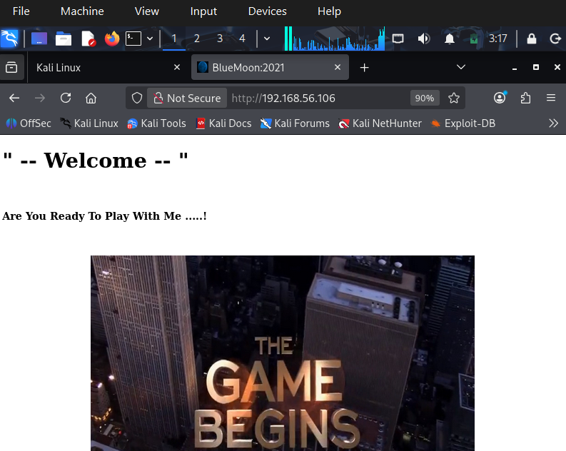

---

## 🔍 Nikto Scan

```bash
nikto -h http://192.168.56.106
```

### Findings:

* Missing security headers
* Outdated Apache version

### 📸 Screenshot:

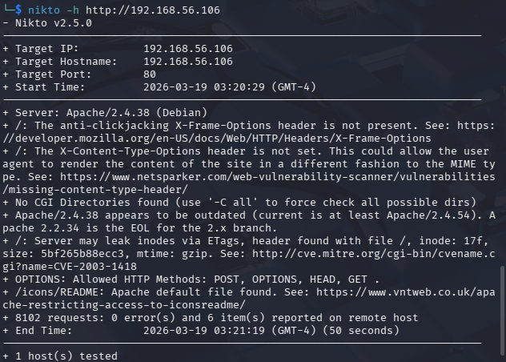

---

## 📂 Directory Enumeration

```bash
gobuster dir -u http://192.168.56.106 -w /usr/share/wordlists/dirb/common.txt
```

### Result:

* No significant directories found

### 📸 Screenshot:

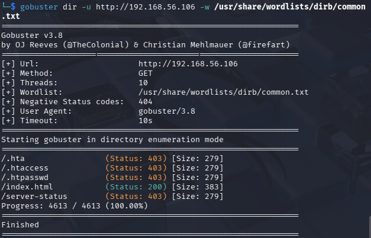

---

## 📁 FTP Enumeration

```bash
ftp 192.168.56.106
```

Login attempt:

```
anonymous / anonymous
```

### Result:

* ❌ Access denied

### 📸 Screenshot:

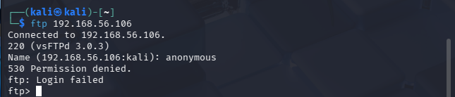

---

## 🧠 Analysis

* Website → no login or exploit
* FTP → restricted
* Directories → none

**Conclusion:** Web and FTP were not viable entry points.

---

# 🔐 8. SSH Brute Force Attempt

### Tool:

* Hydra

```bash
hydra -l root -P /usr/share/wordlists/rockyou.txt 192.168.56.106 ssh
```

---

### Result:

* ~14 million attempts
* Estimated time: ~44 days

### 📸 Screenshots:

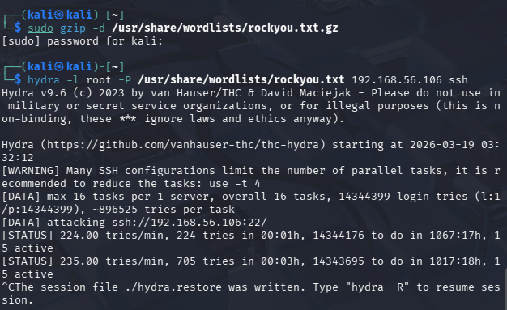
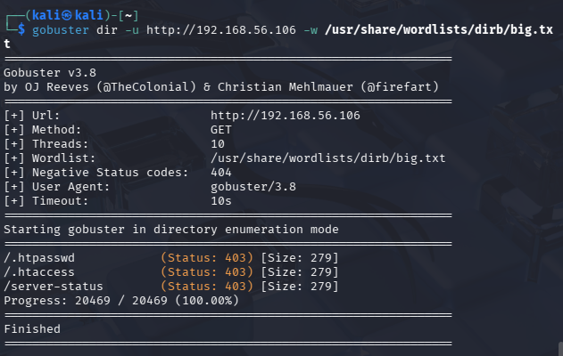

---

### Analysis:

Initial brute-force attack on SSH was found to be inefficient due to large password space. Further enumeration was conducted to identify alternative entry points.

---

# 🧠 9. Advanced Enumeration (Hidden Files)

### Page Source Discovery:

```html
<link rel="icon" href=".blue.jpg">

```

### 📸 Screenshot:

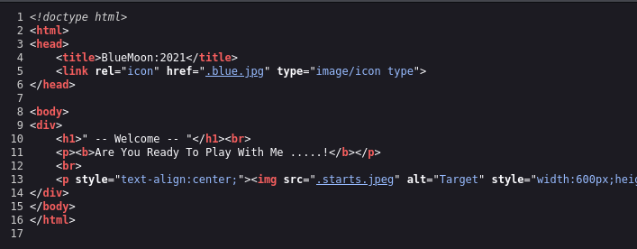

---

### Key Finding:

Files start with `.` (hidden files)

This indicates potential hidden or sensitive data.

---

## 📥 Download Hidden Files

```bash
wget http://192.168.56.106/.blue.jpg
wget http://192.168.56.106/.starts.jpeg
```

### 📸 Screenshot:

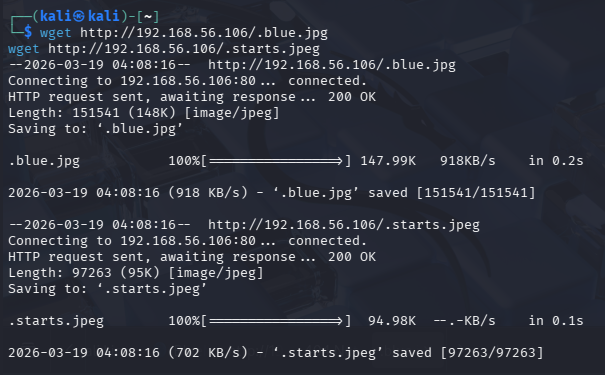

---

## 🔎 File Analysis

### Tools Used:

* strings
* exiftool
* binwalk

### 📸 Screenshots:

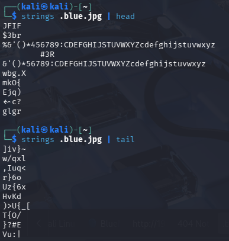

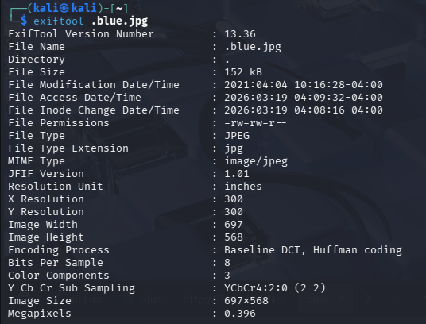
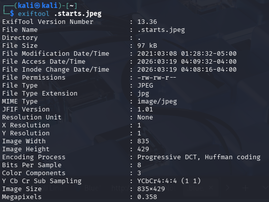

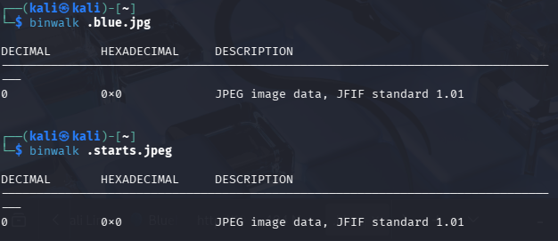
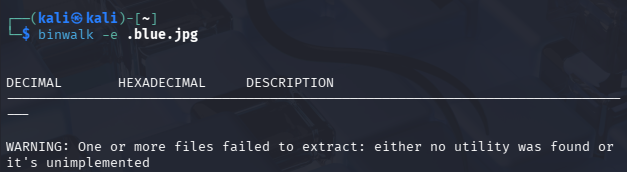

---

## 🕵️ Steganography Analysis

### Tool:

* steghide

```bash
steghide info .blue.jpg
```

### Result:

* Embedded data detected
* Passphrase required

### 📸 Screenshot:

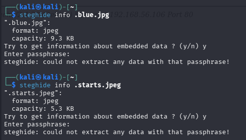

---

### Analysis:

Steganography analysis confirmed the presence of hidden data inside image files. However, the correct passphrase has not yet been identified.

---

# ⚠️ 10. Further Enumeration Strategy

### Attempts Performed:

* Hidden file brute forcing
* Manual URL guessing
* Gobuster with extensions
* HTTP header inspection

---

### Observation:

No direct credentials found, indicating a puzzle-based or hint-driven attack path.

---

# 📊 11. Current Progress

| Stage                | Status         |
| -------------------- | -------------- |
| Reconnaissance       | ✅ Completed    |
| Scanning             | ✅ Completed    |
| Gaining Access       | 🔄 In Progress |
| Privilege Escalation | ❌ Not Started  |
| Maintain Access      | ❌ Not Started  |
| Clear Tracks         | ❌ Not Started  |

---

# 🛡️ 12. Defense Strategies

### Recon:

* Disable network discovery
* Use firewalls

### Scanning:

* Limit open ports
* Use IDS/IPS

### Gaining Access:

* Enforce strong passwords
* Implement account lockout policies

---

# 🧾 13. Conclusion

This lab demonstrated the importance of thorough enumeration and analysis in penetration testing. Initial brute-force attempts were ineffective, leading to deeper inspection of hidden web resources.

The discovery of hidden files and embedded data indicates a steganography-based attack vector, requiring further investigation to obtain system credentials.

---

# 🔮 14. Future Work

* Identify correct steganography passphrase
* Gain system access via SSH
* Perform privilege escalation
* Maintain access and clear logs

---
